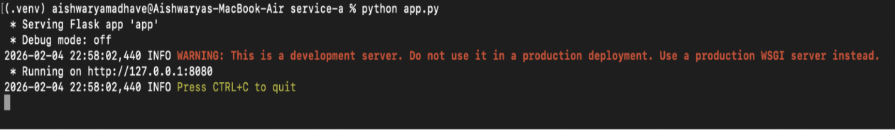
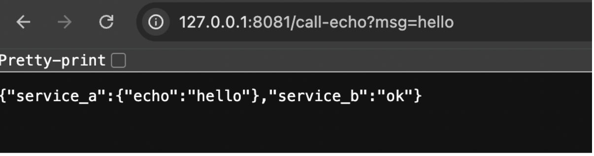
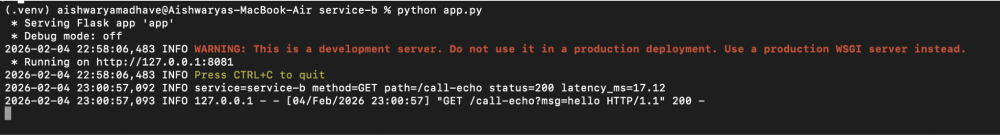
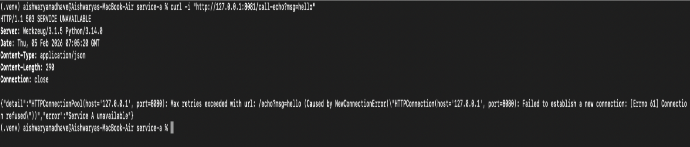

# Python HTTP Track

# CMPE 273 – Week 1 Lab 1
## Tiny Distributed System (Python – Flask)

This project demonstrates a simple locally distributed system with two independent services communicating over HTTP.

---

## Services

### Service A (Echo API)
- Runs on: `http://127.0.0.1:8080`
- Endpoints:
  - `GET /health` → `{ "status": "ok" }`
  - `GET /echo?msg=hello` → `{ "echo": "hello" }`

### Service B (Client)
- Runs on: `http://127.0.0.1:8081`
- Endpoints:
  - `GET /health` → `{ "status": "ok" }`
  - `GET /call-echo?msg=hello`
    - Calls Service A `/echo`
    - Returns combined response
    - Uses timeout and handles failure

---

## How to Run Locally

### Prerequisites
- Python 3.10+
- Git

### Setup
```bash
git clone <your-repo-url>
cd python-http
python3 -m venv .venv
source .venv/bin/activate
pip install -r requirements.txt

## Run Service A
```bash
cd service-a
python -m venv .venv
source .venv/bin/activate
pip install -r requirements.txt
python app.py
```

## Run Service B (new terminal)
```bash
cd service-b
python -m venv .venv
source .venv/bin/activate
pip install -r requirements.txt
python app.py
```

## Test
```bash
curl "http://127.0.0.1:8081/call-echo?msg=hello"
```

Stop Service A and rerun the curl command to observe failure handling.

## Screenshots:

1. Check python 3 and git versions.


2. Git clone.


3. Used “python-http/ (Flask + requests)”.


4. Run both the services A and B.

Service - A - Running:



Service - B - Running:


5. Test Service A health - status is “ok”.


6. Test Service B - echo is “hello” and status is “ok”.



7. Stop service A and keep service B running.

Stopped service A-


Service B is running-



Received HTTP 503 error on the first line in below screenshot.



When run in the browser, you see the JSON error log as shown in below screenshot.


## What makes this distributed?
This is distributed because it consists of two independent services running as separate processes that communicate over a network using HTTP. 
Even though they run on the same machine, they behave like separate systems: one service can fail independently, and the other must handle timeouts and errors gracefully.
